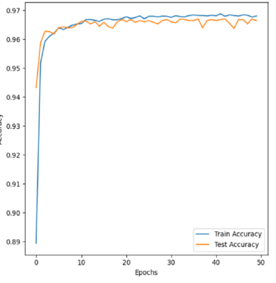
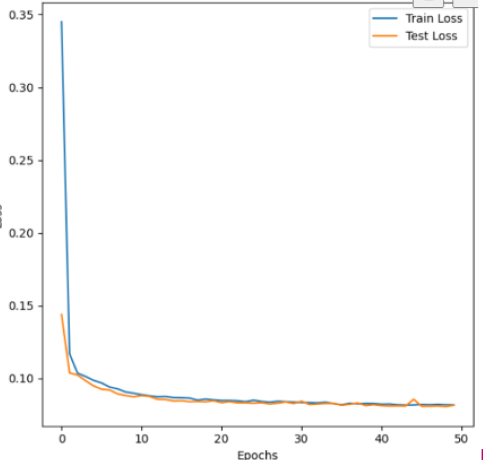
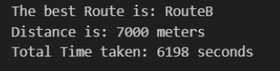

# V2V Communication using Blockchain and BiLSTM Technology

This project implements a **Vehicle-to-Vehicle (V2V) communication framework** using
**Blockchain for security** and **BiLSTM (Bidirectional LSTM)** for predictive analytics.
The goal is to provide a **secure, tamper-proof, and intelligent communication system**
for next-generation intelligent transportation networks.

---

## 🚗 Project Overview

Modern V2V systems require:

* **Authentication** of sender vehicles
* **Integrity** of transmitted messages
* **Prediction of traffic patterns / abnormal events**
* **Real-time low-latency communication**

This project integrates:

1. **Blockchain** → ensures secure message broadcasting without tampering
2. **BiLSTM Neural Network** → predicts and classifies communication patterns
3. **V2V simulation layer** → simulates vehicle messages and interactions

---

## 🧱 Core Components

### **1. Blockchain Layer**

* Implemented using Python
* Stores communication logs
* Verifies each vehicle using hashing
* Prevents data tampering & replay attacks

### **2. BiLSTM Prediction Model**

* Built using **TensorFlow/PyTorch**
* Predicts:

  * abnormal communication behavior
  * collision warnings
  * message authenticity
* Trained on time-series V2V message data

### **3. V2V Communication Simulation**

* Generates vehicle messages (speed, location, alerts)
* Vehicles send messages → blockchain validates → BiLSTM analyzes
* Demonstrates end-to-end secure communication

---

## 🗂 Project Structure

```
📦 V2V-Blockchain-BiLSTM
 ┣ 📁 Results
 ┣ 📁 Project
 ┣ 📁 sample_dataset
 ┣ 📁 results
 ┗ README.md
```

---

## 🛠 Technologies Used

| Component      | Technology                    |
| -------------- | ----------------------------- |
| Security Layer | Blockchain (Python)           |
| ML Model       | BiLSTM (TensorFlow / PyTorch) |
| Data           | V2V communication logs        |
| Scripting      | Python                        |
| Visualization  | Matplotlib / Seaborn          |

---

## 🚀 How to Run

### **1. Install Dependencies**

```bash
pip install -r requirements.txt
```

### **2. Start the V2V Simulation and Run Blockchain (project.py)**

```bash
python Project/project.py
```

### **3. Train the BiLSTM Model(ML.ipynb)**

```bash
jupyter notebook Project/ML.ipynb
```

---

## 📊 Results & Visualizations

## Simulation Result Screenshot


## Accuracy vs Epochs  


## Loss vs Epochs  


## Prediction Output  



---

## 📌 Future Enhancements

* Integrating real-time GPS feed
* Multi-vehicle platooning system
* Smart contract-based decentralized V2V access control
* Deployment on edge devices
* Integration with VANET simulators like SUMO / Veins

---

---

## 🧑‍🏫 Guide

* **Dr. Jahnvi Tiwari**

## 👨‍💻 Contributors

* **Ch. Vivek**
* **T. Manikanth**

---

## 📜 License

This project is released under the V2V-BLOCKCHAIN-BILSTM License (Custom License).
You are free to use, study, and modify the code for academic and research purposes only.
Commercial use is strictly prohibited without written permission from the author.

See the full LICENSE file in this repository for details.
